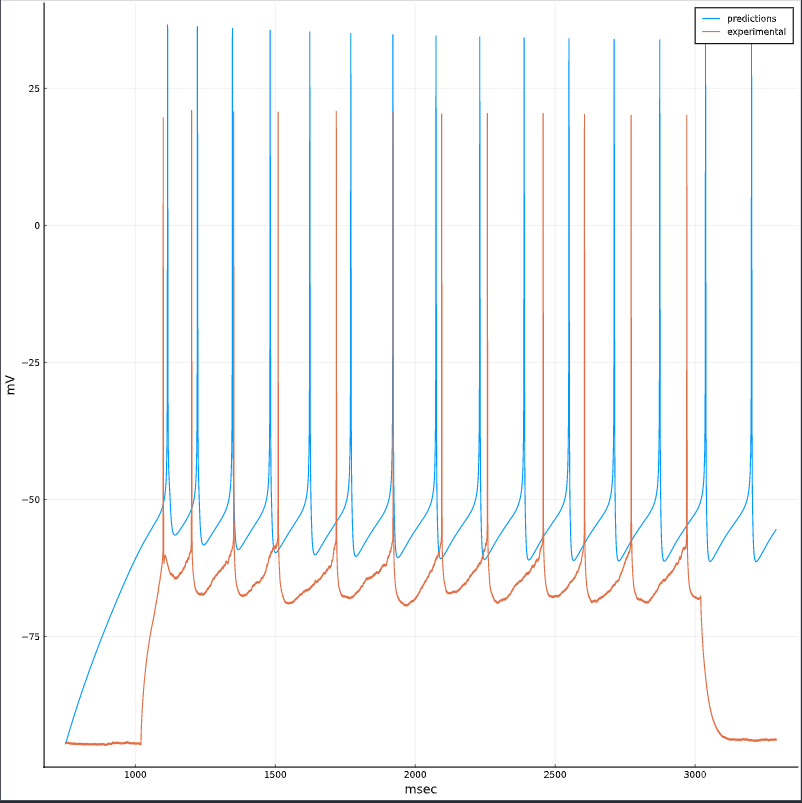
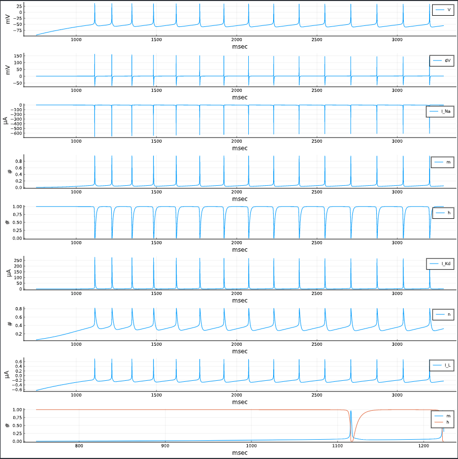
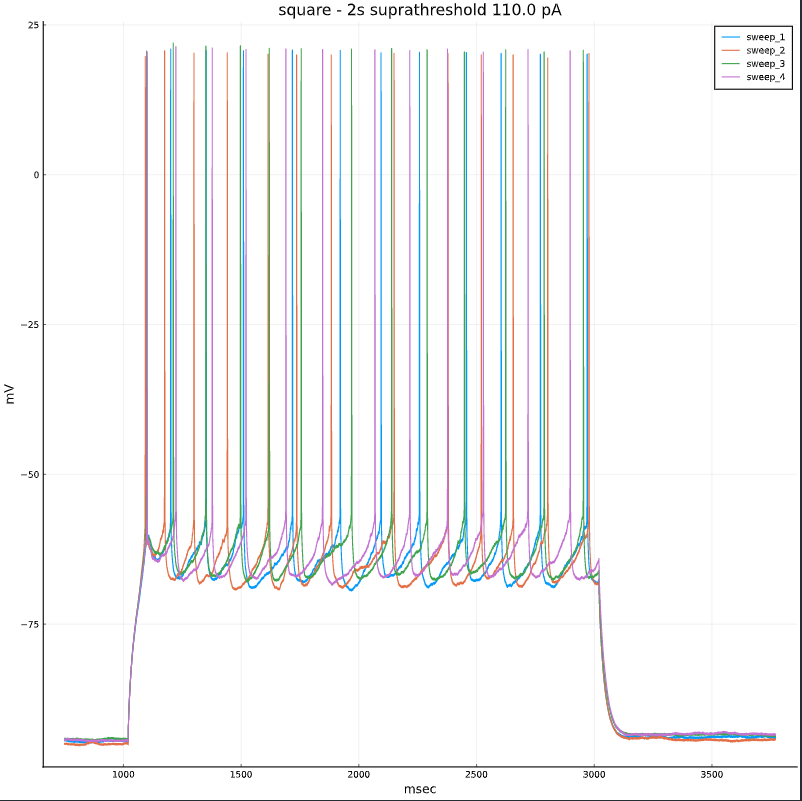

# Neuronal Model Calibration Framework

## Introduction

Hello,

We would like to introduce a neuronal model calibration framework, with the idea of being very user friendly for the beginners, but retaining high customization capabilities for the domain expert. 

This post is organized as follows: 

* [Section 1](#1. Overview) gives an overview of the issues addressed by this framework;
* [Section 2](#2. Worked Example) goes through the current interface to showcase some capabilities (we tried to keep it as light and readable as possible);
* [Section 3](#3. Possible Applications from Literature) provides some literature example that fits naturally within our framework;
* [Section 4](#4. Long Term Developments / Needed Contributions) discusses the areas where we'd need contribution from people more experienced than us;
* [Section 5](#5. Example Calibration Results) illustrates some aspects of the current framework by looking at an use case with images. 

We have developed a model calibration pipeline, where the model is a [DifferentiaEquations.jl](https://github.com/SciML/DifferentialEquations.jl)-compatible system, and though our intentions are very ambitious (see [section 4](#4. Long term developments / Needed Contributions) ), the full support is now only guaranteed for Hodgkin-Huxley (HH) type models. In this context, the pipeline focuses on calibrating HH-type models w.r.t. voltage traces coming from electrophysiological recordings.

The pipeline assists the modeller in the tasks of electrophysiological data collection, model specification and model fitting. Many calibration features have been implemented (the main focus has been around the methodology first devised in [Druckmann2007](https://www.frontiersin.org/articles/10.3389/neuro.01.1.1.001.2007/full), and then extended by numerous papers, e.g. Allen Brain Atlas's [technical whitepapers]()), and pretty much every main optimization technique that to our knowledge is available in Julia has been integrated (e.g. [Optim.jl](https://github.com/JuliaNLSolvers/Optim.jl), [Turing.jl](https://github.com/TuringLang/Turing.jl), [Evolutionary.jl](https://github.com/wildart/Evolutionary.jl), [Metaheuristics.jl](https://github.com/jmejia8/Metaheuristics.jl), [BlackBoxOptim.jl](https://github.com/robertfeldt/BlackBoxOptim.jl), etc. ) and they are all accessible and fully customizable through a unified interface.

## 1. Overview

- Before having a look at the currently developed interface, let me be more specific about the purpose and the setting of the pipeline. We will also briefly present the ideas behind and cite the main references.

  Compartmental neuron models are inherently hard to calibrate w.r.t. electrophysiological recordings, because of:

  1. Their high degree of nonlinearity, which may induce:
     - **simulation issues**:  solver selection and optimization, computational time, etc. ;
     - **loss function complexity** ;
     - **train set identification**: difficulty in identifying a train set "that covers the whole dynamical range" of the neuron, which is equivalent to asking which is the best minimal set of stimuli to use as a train set, so that the calibrated model performs best on the test set, see [Druckmann2011](https://journals.plos.org/ploscompbiol/article?id=10.1371/journal.pcbi.1002133) . 
  2. **Stochasticity of the underlying physical system**: this implies that given a neuron, the same input (injected current) does not produce the same output (voltage trace) every time it is applied. This requires :
     - **feature-based parameter estimation**: since the voltage trace varies from sweep to sweep, its raw points cannot be used as a reliable way to measure a parameters set performance (and thus to calibrate a model). One must resort to the the extraction of features (defined by a domain expert) from that trace.
     - **calibration refinements**: it could be necessary to perform successive calibration techniques to obtain a better fit.

  These issues have been addressed in our work as follows:

  - **simulation issues**: we employed [DifferentialEquations.jl](https://github.com/SciML/DifferentialEquations.jl) efficient solving capabilities, and implemented an (almost) automated HH-type model conversion from the *gating variable rates formalism* (GVRF) to the *boltzmann terms formalism* (BTF), which makes out-of-dynamic-range derivatives more controllable during calibration ([Chen2010](https://ieeexplore.ieee.org/document/5491188) and [Thot2011](https://link.springer.com/article/10.1007%2Fs00422-011-0459-1)). This is achieved thanks to a set of structs representing membrane `Current`s and `Gating_Variable`s that are aware of the formalism they are written in ;
  - **train set identification**: the pipeline allows for simultaneous multi-sweep calibration, where sweep grouping by stimulus type and amplitude is supported (and in some cases automatized), and so is the extraction of electrophysiological features means and standard deviations from such groups. These groups of sweeps are represented using a struct `Type_Amplitude`, which contains all sweeps obtained injecting the same stimulus (defined by a "type" which can be a *ramp*, a *square* and so on, and an "amplitude" expressed in pA). Thus the ideas behind [Druckmann2011](https://journals.plos.org/ploscompbiol/article?id=10.1371/journal.pcbi.1002133) can be easily tested, so as every other experiment ;
  - **feature-based parameter estimation**: the pipeline integrates electrophysiological features through a `Feature` struct, whose use is highlighted below. `Feature`s also support *combination*, as in [Hay2011](https://journals.plos.org/ploscompbiol/article?id=10.1371/journal.pcbi.1002107), even though more general `combination`s have been made possible. `Feature`s values extracted from the data and from the simulated model are regularly compared during calibration, and the comparison is done through a loss function: this (together with many other details) can be independently specified for each `Feature`, and many common features have been already implemented. If the user wishes to adopt a custom feature, much support for [Allen SDK](https://allensdk.readthedocs.io/en/latest/) and [eFel](https://efel.readthedocs.io/en/latest/) is already there ;
  - **complex loss functions**: this probably determined the poor performance of derivative-based optimization algorithm such as the BFGS from [Optim.jl](https://github.com/JuliaNLSolvers/Optim.jl) (even though it's fair to say that we have little experience about hyperparameter tuning of optimization algorithms, see [section 5](#5. Long term developments / Needed Contributions)), in favor of evolutionary algorithms, especially the ones supporting multi-objective optimization, that could be found in [Metaheuristics.jl](https://github.com/jmejia8/Metaheuristics.jl) and [BlackBoxOptim.jl](https://github.com/robertfeldt/BlackBoxOptim.jl) ;
  - **calibration refinements** : this pipeline has been built using a modeling package that we hope to publish in the near future. As such, it supports multi-step calibration, so that multiple calibration techniques may be stacked together, each one improving on the results of the previous one.

## 2. Interface Details

### Performance gain through formalism selection

Usually, papers report model equations in the  *gating variables rates formalism* (GVRF), i.e. equations of gating variables are of the form:

$$
\begin{equation}
\frac{dx}{dt}(V) = \alpha(V)(1-x)-\beta(V)x
\end{equation}
$$
where generally ([Wikipedia](https://en.wikipedia.org/wiki/Hodgkin%E2%80%93Huxley_model)):

$$
\begin{equation}
\alpha , \beta \sim \frac{A(V-B)}{e^{\frac{V-B}{C}}-D}
\end{equation}
$$
Note that the $\alpha$ and the $\beta$ are in terms of exponentials. This causes numerical instability when the optimizer proposes a parameters set "outside of the usual". Fortunately, it is possible to precisely approximate those exponentials inside the dynamic range using hyperbolic tangents, with the benefit that these are much better behaved in "unusual" parameters regions ([Thot2011](https://link.springer.com/article/10.1007%2Fs00422-011-0459-1)). Luckily, there already exists a formalism, that we will for clarity named *Boltzmann terms formalism* (BTF), that makes use of hyperbolic tangents-based equations. In this formalism, a gating variable follows:

$$
\begin{equation}
\frac{dx}{dt}(V) = \frac{x_{\infin}(V) - x }{\tau_x(V)}
\end{equation}
$$
Where:

$$
\begin{cases}
x_{\infty} = \frac{1}{2}(1 + tanh(\frac{V - V_{ \frac{1}{2} } }{\kappa})) \\ \\
\tau_{x} = τ_0 + τ_{max}(1 − tanh(\frac{V(t) − V_{\frac{1}{2}}}{σ})^2)
\end{cases}
$$
Thus we implemented a set of functionalities that allows the user to code the model as she/he would find it in literature (both equations and parameters values, usually in the GVRF), and then automatically get the corresponding parameters values in the BTF.

### Model instantiation

This first step being optional, the interface allows the user to instantiate its model via an `HH_model` struct. This struct represents together:

- the deterministic part of the model dynamics ;
- an optional additive stochastic component (purely stochastic models are a work in progress) ;
- its `calibration_history`, an object keeping track of calibration-related events, such as parameters values at a certain stage of the calibration (see below for *multi-step calibration*), and similarly posteriors, diagnostic plots, calibrated initial conditions, etc. ;
- a function that evaluates the initial conditions of the model, given its parameters values (this is a neuroscience-specific feature, see [indico.ictp](# see indico.ictp : http://indico.ictp.it/event/a13235/session/99/contribution/371/material/0/1.pdf) ) ;

### Dataset loading

Our neuroscientific framework is fully integrated with [Allen SDK](https://allensdk.readthedocs.io/en/latest/) via [PyCall.jl](https://github.com/JuliaPy/PyCall.jl) (its Julia-callable modules being actually exported). Thus, we wrapped its methods in a `get_cell_dataset` function that retrieves all sweeps that have been recorded from a given cell, and groups them first by stimulus type and then by amplitude. It also allows for accessing electrophysiological metadata in an organized way, in order to find "the right cell" for the modeler's purposes (this feature is working but needs feedback by domain experts for improvements).

### Features 

As stated in the **feature-based parameter estimation** bullet point, it makes little sense to use the raw membrane potential time series as reference data to calibrate against. A more optimal solution would be the identification of a set of features of these time series that is both minimalistic and fully encodes electrophysiological dynamics. Our framework supports the use of features via a `Feature` struct, that allows for defining custom electrophysiological features and easily plug them into the calibration pipeline. It is possible to specify a specific loss function for each feature, and the methodology described in [Druckmann2007](https://www.frontiersin.org/articles/10.3389/neuro.01.1.1.001.2007/full) is out-of-the-box integrated and customizable. Also, the pipeline supports simultaneous calibration w.r.t. multiple stimuli, as described in  [Druckmann2011](https://journals.plos.org/ploscompbiol/article?id=10.1371/journal.pcbi.1002133).

### Calibration setup

The idea behind the following setup is the utilization of a framework that can be generalized to as many other fields than neuroscience as possible. The information needed to setup the calibration is a set of associations between experimental data and features that we want to calibrate our model against simultaneously.

Following [Druckmann2007](https://www.frontiersin.org/articles/10.3389/neuro.01.1.1.001.2007/full) , the "unit of data" is a group of sweeps coming from the same cell when injected with a particular stimulus (defined by its type and amplitude), that we encoded in a `Type_Amplitude` struct. Such `Type_Amplitude` are easily extracted from the output of `get_cell_dataset` via the interface.

Then to each `Type_Amplitudes` the user should associate a set of feature to calibrate the model against, and this is done via an `Association` struct.

A `Tuple` of associations constitutes the whole dataset and feature we want to calibrate against. The next step is to use a multi-step calibration interface we previously developed, that lets the modeler easily select the calibration algorithm she/he prefers, though retaining much (in many cases full) customizability of the same. By just assigning one function attribute, the following libraries are already integrated:

- [Optim.jl](https://github.com/JuliaNLSolvers/Optim.jl) 
- [Turing.jl](https://github.com/TuringLang/Turing.jl) 
- [Evolutionary.jl](https://github.com/wildart/Evolutionary.jl) 
- [Metaheuristics.jl](https://github.com/jmejia8/Metaheuristics.jl) 
- [BlackBoxOptim.jl](https://github.com/robertfeldt/BlackBoxOptim.jl)

And some, like [ApproxBayes.jl](https://github.com/marcjwilliams1/ApproxBayes.jl) are a work in progress. Whenever possible, multi-objective calibration is enabled, for maximum calibration performance and tuning.

Many plotting functions are already available for: phase space trajectory representation, calibration quality assessment and data visualization.

## 3. Possible Applications from Literature

Although this work is far from over, we believe there is some value in it, the interested reader may confirm that applications such as  [Buhry2012](https://www.sciencedirect.com/science/article/abs/pii/S0925231211006618?via%3Dihub) easily fit in our framework, since the necessary algorithms are already integrated, and the possibility of defining custom `Feature`s  is already there. On the other hand, the integration of techniques like the one found in [Thot2011](https://link.springer.com/article/10.1007%2Fs00422-011-0459-1), may still require some effort. Other techniques, like the one based on the *coincidence factor* in [Xu2019](https://ieeexplore.ieee.org/document/8682825) and the *phase plane trajectory density* in [Achard2006](https://journals.plos.org/ploscompbiol/article?id=10.1371/journal.pcbi.0020094) and [LeMasson and Maex, 2001](https://www.researchgate.net/publication/329683440_Introduction_to_equation_solving_and_parameter_fitting), have already been integrated.

## 4. Long Term Developments / Needed Contribution

Developing a model calibration framework requires a large and heterogeneous amount of expertise  that we are currently missing. 

Although we haven't given up yet, despite following the advices in [Druckmann2011](https://journals.plos.org/ploscompbiol/article?id=10.1371/journal.pcbi.1002133) the optimization algorithms always output a "best parameters set" that is indifferent to the applied stimulus (within a certain range). See [section 5](#5. Example Calibration Results) for a better visualization of this issue. We probably ruled out the possibility that it is a bug, and it may be correlated to the following other areas where we lack expertise:

- **Optimization algorithm tuning**. Here is a [twitter thread]() with references and the question in more details when it comes to evolutionary algorithms. Also, [Turing.jl](https://github.com/TuringLang/Turing.jl) is fully supported and usable with the same interface above (just set `method = :turing_neuro`), and although it works well on another project we are developing on epidemiological models, it achieves very poor performance on HH-type models. So we would be very grateful if anybody could help with these issues.  
- **Modeling choices**. It may be that the HH-type models we tried so far (the most complete of them being the one shown above) may be inappropriate, or we could be missing some relations between the cell we select the train sweeps from and the model itself. We don't know whether multi-compartmental models are unavoidable, as the literature seems to suggest, or if we could dramatically improve calibration performance by just more fine tuning of the single-compartment models we are currently using. Also, this framework may need modifications in orderer to be compatible with GLIFs and multi-compartmental models.
- **Optimization techniques**. We have not been able to implement every possible calibration technique. A particularly relevant and missing one are Kalman Filters. Some possible references on the subject may be [Lankarany2014](https://www.sciencedirect.com/science/article/abs/pii/S0925231214001155?via%3Dihub), [Campbell2019](https://www.mdpi.com/2076-3417/10/2/550) (for the inverse problem), [Moye2018](https://mathematical-neuroscience.springeropen.com/articles/10.1186/s13408-018-0066-8) and [Lillacci2010](https://journals.plos.org/ploscompbiol/article?id=10.1371/journal.pcbi.1000696), but there may be better ones. Any help would be greatly appreciated. Other techniques we did not implement are the ones presented in [Vavoulis2012](https://journals.plos.org/ploscompbiol/article?id=10.1371/journal.pcbi.1002401#pcbi.1002401-Kitagawa1), [Haufler2007](https://www.sciencedirect.com/science/article/abs/pii/S092523120600347X) and [Meliza2014](https://link.springer.com/article/10.1007%2Fs00422-014-0615-5).

We would be very grateful if anybody could help with these issues. 

## 5. Example Calibration Results

Here is the output of an 8-hour run, where we calibrated the above HH__Na_Kd_M_L model w.r.t. the `square_110pA` sweeps set (which counted 4 sweeps), using the following features:

- **time_of_slow_trough_fraction**: time from the spike peak to the slow through, divided by the isi length, adimensional ;
- **AP_width_hh_msec**:  width at half-height of the action potential, expressed in msec ;
-  **adaptation_index**: adaptation index, adimensional ;
-  **firing_frequency_Hz**: firing frequency, expressed in Hz ;
-  **isi_cv**: interspike interval (durations) coefficient of variation, adimensional;
-  **latency_to_first_spike_msec**: time from start of recording to first peak, expressed in msec ;
-  **duration_of_first_isi_msec**: duration of first interspike interval, expressed in msec ;
-  **action_potential_peak_mV**: action potentials' peaks height, expressed in mV ;
-  **fast_trough_depth_mV**: fast through depth, expressed in mV ;
-  **average_isi_msec**: average interspike interval duration, expressed in msec ;
-  **resting_potential_mV**: resting potential, expressed in mV ;
-  **slow_trough_depth_mV**: slow through depth, expressed in mV .

More details about these features are provided in the Allen technical whitepaper [Electrophysiology Overview](http://help.brain-map.org/display/celltypes/Documentation).

The achieved performance, in units of experimental standard deviation (see [Druckmann2007](https://www.frontiersin.org/articles/10.3389/neuro.01.1.1.001.2007/full)) is:

- **time_of_slow_trough_fraction**: 2.23066 ;
- **AP_width_hh_msec**:  5.36808 ;
-  **adaptation_index**: 1.02698 ;
-  **firing_frequency_Hz**: 1.96846 ;
-  **isi_cv**: 1.32066 ;
-  **latency_to_first_spike_msec**: 3.13225 ;
-  **duration_of_first_isi_msec**: 0.12058 ;
-  **action_potential_peak_mV**: 7.20770 ;
-  **fast_trough_depth_mV**: 1.49870 ;
-  **average_isi_msec**: 1.76509 ;
-  **resting_potential_mV**: 9.74667 ;
-  **slow_trough_depth_mV**: 3.67717 ;

which amounts to an aggregated loss of 39.063, that while being not too far from the 3 standard deviations per features goal (3*12 = 36), it is not very much satisfying either. Infact, if one looks at a simulated trace (blue) plotted together with one of the sweeps used for calibration:

She/he may notice that:

- Spike coincidence is not a visual feature to take into consideration when qualitatively judging the results of a calibration run, since there is great variance in spike times (see plot below) ;
- The parameters set found does not take the injected current into consideration, as it keeps spiking well beyond the end of the current stimulus.

To address the second issue, we tried the following strategies without success:

- incorporate a latency_to_last_spike feature ;
- calibrate w.r.t. 4 `Type_Amplitude`s (recall that each  `Type_Amplitude` is a sweeps set corresponding to one stimulus waveform ), 3 of which did not produce any spike in the real neuron ;

None of these secceded.

We wrap up by showing more plots relative to the above run:

Model currents, gating variables dynamics (with zoom in on first spike):

Same with voltage on the x-axis:

All the experimental sweeps used:

In our opinion, this example shows both the possibilities of this framework, and the issues that still persist.

We hope to have even slightly caught your attention, don't hesitate to reach out if you think you may give some much needed help and suggestions!

[@johnmyleswhite](https://twitter.com/johnmyleswhite), [@KristofferC89](https://twitter.com/KristofferC89), [@briochemc](https://twitter.com/briochemc), [@benskuhn](https://twitter.com/benskuhn), [@drfeldt](https://twitter.com/drfeldt), [@ranjan_ananth](https://twitter.com/ranjan_ananth), [@baggepinnen](https://twitter.com/baggepinnen), [@ChrisRackauckas](https://twitter.com/ChrisRackauckas) [@vchuravy](https://twitter.com/vchuravy), [@rogerluorl18](https://twitter.com/rogerluorl18)  [@TuringLang](https://twitter.com/TuringLang), [@xukai92](https://twitter.com/xukai92), [@Hong_Ge2](https://twitter.com/Hong_Ge2), [@cameron_pfiffer](https://twitter.com/cameron_pfiffer), [@martin_trapp](https://twitter.com/martin_trapp), [@MathieuEmile](https://twitter.com/MathieuEmile), [@torfjelde](https://twitter.com/torfjelde), [@sethaxen](https://twitter.com/sethaxen), [@ANoackJensen](https://twitter.com/ANoackJensen), [@HarrisonDWilde](https://twitter.com/HarrisonDWilde)

@AlexGuetMcC , @AmitChaudhariMD, @Anna__K__K , @bradleyvoytek   , @misicbata       , @ChristianPehle  , @DamienQuerlioz  , @cdmeliza   , @MelissaRWarden  , @DrValiante      , @gmiotto         , @Segev_Lab   , @neurodidact     , @julie_grollier  , @lauracrucianel1 , @ogrisel         , @TheBrunoCortex  , @wake_sleep  , @RichCompNeuro   , @sergeydoestweet , @ShaulDr     , @neuronJoy       , @srikipedia      , @SylvainSaighi

@bcm_neurosci   ,@ChenLabNeuro   ,@ChicagoSfN     ,@C_R_A_N_I_A    ,@EITN_Paris     ,@ELSCbrain      ,@EPFL_en        ,@BlueBrainPjt   ,@INCForg        ,@HBPBrainSim    ,@HBP_Education  ,@KCNHub         ,@NeuralCompLab  ,@NeurIPSConf    ,@NIN_knaw       ,@NeuroPSI_saclay,@RadioSpin_EU   ,@SurLabMIT      

